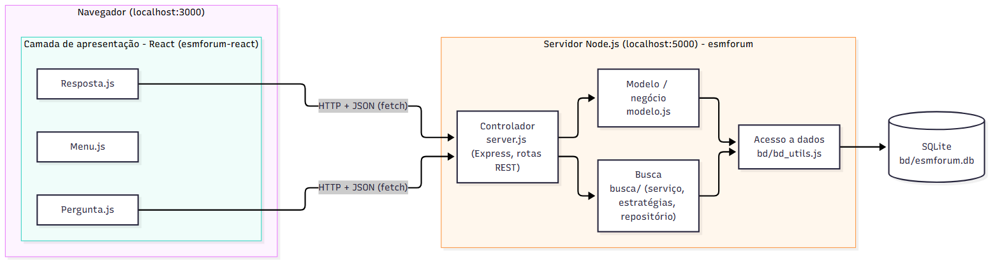

# Análise Arquitetural do ESM Forum

## 1. Identificação da arquitetura

### Estilos arquiteturais

O ESM Forum combina três estilos:

1. **Cliente-servidor.** O frontend (React, no navegador, porta 3000) e o backend (Node.js com Express, porta 5000) são dois programas separados, em dois repositórios, que executam em processos diferentes.
2. **API REST sobre HTTP/JSON.** O backend expõe recursos por URL e verbo HTTP (`GET /`, `POST /perguntas`, `GET /respostas/:id_pergunta`, `POST /respostas` e, com a busca, `GET /perguntas/busca`). O frontend é uma *Single Page Application*: carrega uma vez e, depois, só troca dados JSON com a API.
3. **MVC (variação).** A documentação do próprio projeto (`docs/arquitetura.md`) o descreve como uma variação de MVC, na qual a **Visão** é a SPA em React, o **Controlador** é o `server.js` e o **Modelo** é o `modelo.js`.

Ao todo, é uma arquitetura em camadas simples, em que cada camada só fala com a vizinha.

### Camadas existentes

| Camada | Onde está | Responsabilidade |
|---|---|---|
| **Apresentação** | `esmforum-react/src` (`Menu.js`, `Pergunta.js`, `Resposta.js`, `Sobre.js`) | Exibir a interface, capturar as ações do usuário e chamar a API com `fetch` |
| **Controle (API)** | `esmforum/server.js` | Definir os endpoints, ler a requisição, chamar o modelo e devolver JSON com o código HTTP |
| **Negócio** | `esmforum/modelo.js` e `esmforum/busca/servico_busca.js` | Operações sobre perguntas e respostas e regra da busca |
| **Dados** | `esmforum/bd/bd_utils.js`, `busca/repositorio_perguntas.js`, `bd/schema.sql` e o arquivo SQLite | Executar comandos SQL e persistir os dados |

**Observação importante:** no código original, as camadas de negócio e de dados não estão separadas. O `modelo.js` contém as regras e também o SQL (ver `ANALISE_SOLID.md`). A separação só existe de forma clara no módulo da busca, que tem serviço e repositório distintos. Por isso a arquitetura é, na prática, de **três camadas em que a do meio é acumulada**: apresentação, controle e um modelo que também acessa o banco.

### Comunicação entre frontend e backend

- Protocolo **HTTP**, formato **JSON**, com a API `fetch` do navegador.
- O endereço do backend (`http://localhost:5000`) está escrito diretamente em `Pergunta.js` e `Resposta.js`. Não há arquivo de configuração nem variável de ambiente.
- Como o frontend (porta 3000) e o backend (porta 5000) têm origens diferentes, o navegador aplicaria a política de mesma origem. O `server.js` resolve isso com um *middleware* que envia `Access-Control-Allow-Origin: *` (CORS).
- Não há autenticação nem sessão: o autor de toda pergunta é o usuário fixo `1`.
- A comunicação é sempre iniciada pelo cliente (requisição e resposta). O servidor não envia dados por iniciativa própria, o que é relevante para a futura funcionalidade de notificações (ver `PROPOSTA_ARQUITETURA.md`).

### Endpoints

| Método e caminho | Função |
|---|---|
| `GET /` | Lista todas as perguntas, com `num_respostas` |
| `POST /perguntas` | Cadastra uma pergunta (corpo `{ "pergunta": "..." }`) |
| `GET /perguntas/busca?q=&modo=` | Busca perguntas por palavra-chave (introduzido na Parte 3) |
| `GET /respostas/:id_pergunta` | Devolve a pergunta e suas respostas |
| `POST /respostas` | Cadastra uma resposta (corpo `{ "id_pergunta": ..., "resposta": "..." }`) |

## 2. Diagrama arquitetural

Fonte: [arquitetura_atual.mmd](diagramas/arquitetura_atual.mmd)

**Como ler o diagrama:** as caixas grandes são os dois processos em execução (navegador e servidor). Dentro do servidor, as setas mostram a direção das chamadas: o controlador chama o modelo (ou a busca), e ambos usam o acesso a dados, que fala com o SQLite. Entre o navegador e o servidor, a comunicação é HTTP com JSON.

### Fluxo de dados (exemplo: listar perguntas)

1. O componente `Pergunta` do React é montado e executa `fetch('http://localhost:5000/perguntas/busca?q=')`.
2. O Express recebe a requisição, passa pelos *middlewares* (JSON e CORS) e chega à rota.
3. A rota chama `busca.buscar(...)`, que pede as perguntas ao repositório.
4. O repositório executa o SQL pelo `bd_utils.js`, e o SQLite devolve as linhas.
5. O serviço aplica o filtro (se houver termo) e devolve a lista.
6. A rota responde com JSON, e o React atualiza o estado (`setListaPerguntas`), redesenhando a tabela.

## 3. Pontos fortes e limitações

**Pontos fortes:** é simples de entender (poucos arquivos e uma direção clara de dependência), tem separação de frontend e backend, e usa uma API REST simples que pode ser consumida por outros clientes.

**Limitações identificadas:**
- Negócio e dados misturados em `modelo.js`, o que dificulta testar as regras isoladamente.
- Controlador em um único arquivo, com tratamento de erros repetido em cada rota.
- URL do backend fixa no frontend.
- Sem conceito de usuário nem autenticação, o que bloqueia as funcionalidades de perfil, votação por usuário e notificações.
- Sem mecanismo para o servidor avisar o cliente (necessário para notificações em tempo real).

Essas limitações motivam a proposta de organização de `PROPOSTA_ARQUITETURA.md`.
