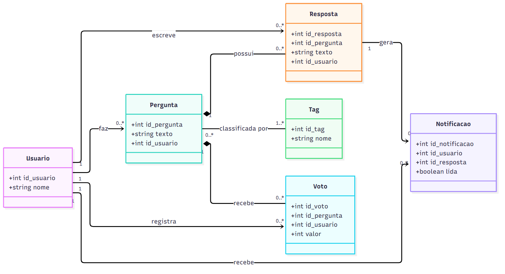
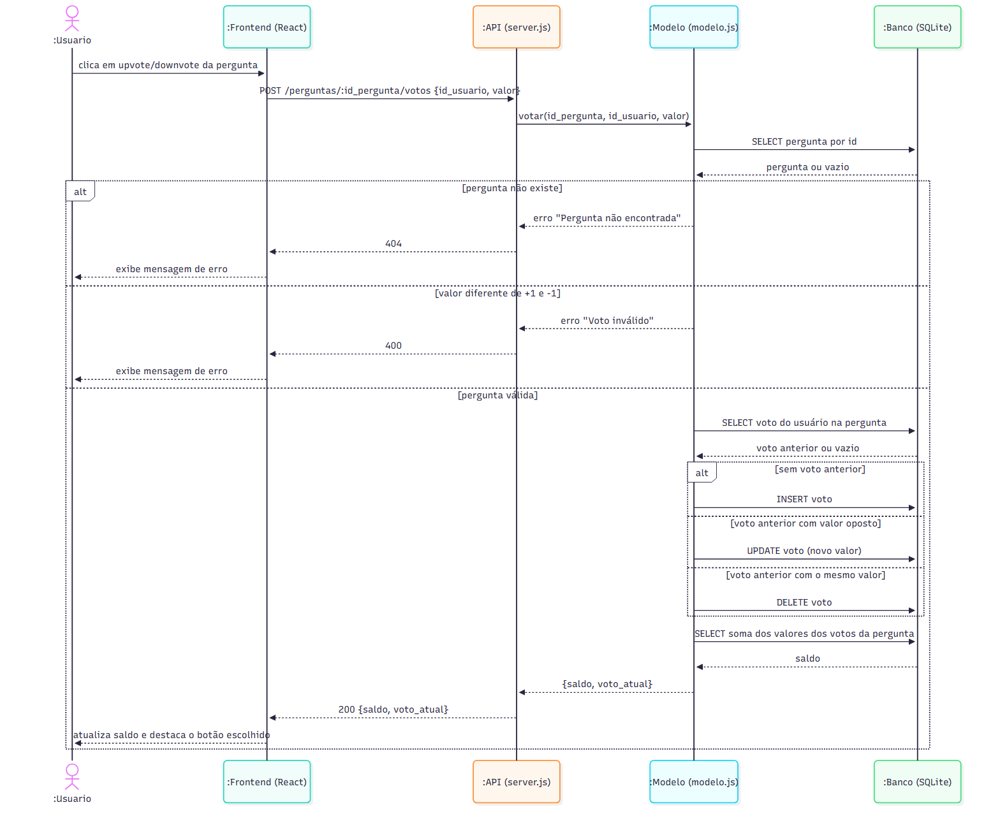
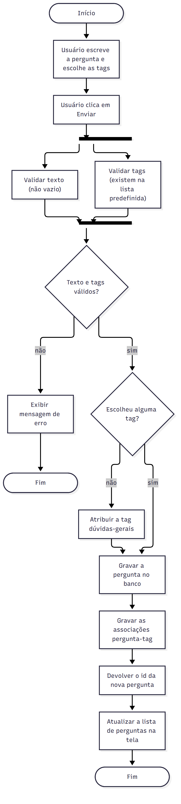
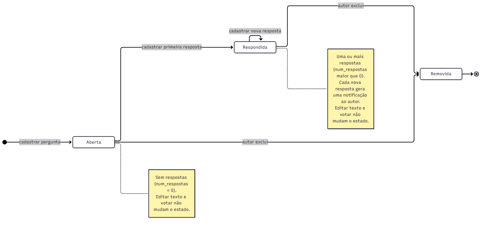

# Diagramas UML do ESM Forum

Os diagramas modelam o sistema atual (Pergunta, Resposta) e as extensões das histórias de `HISTORIAS.md` (votação, tags), além das classes necessárias às outras funcionalidades pedidas pelo cliente (usuário e notificação). Usei UML de forma leve, como esboço para comunicar ideias.

Cada diagrama tem o arquivo de imagem (`.png`) e o arquivo fonte em Mermaid (`.mmd`), na pasta [diagramas/](diagramas/). Os `.mmd` podem ser abertos e editados em https://mermaid.live.

| Diagrama | Imagem | Fonte |
|---|---|---|
| Classes | [diagrama_classes.png](diagramas/diagrama_classes.png) | [diagrama_classes.mmd](diagramas/diagrama_classes.mmd) |
| Sequência | [diagrama_sequencia.png](diagramas/diagrama_sequencia.png) | [diagrama_sequencia.mmd](diagramas/diagrama_sequencia.mmd) |
| Atividades | [diagrama_atividades.png](diagramas/diagrama_atividades.png) | [diagrama_atividades.mmd](diagramas/diagrama_atividades.mmd) |
| Estados | [diagrama_estados.png](diagramas/diagrama_estados.png) | [diagrama_estados.mmd](diagramas/diagrama_estados.mmd) |

## 1. Diagrama de Classes

**O que existe hoje** (ver `bd/schema.sql`): `Pergunta` (`id_pergunta`, `texto`, `id_usuario`) e `Resposta` (`id_resposta`, `id_pergunta`, `texto`). A classe `Usuario` ainda não existe no banco: `id_usuario` é sempre 1.

**O que foi adicionado para as extensões:**
- `Usuario`: necessária para votos, perfil e notificações. Por isso `Resposta` ganha também `id_usuario` (quem respondeu), o que permite o histórico do perfil.
- `Voto`: guarda `valor` (+1 ou -1). Uma restrição de unicidade sobre (`id_pergunta`, `id_usuario`) garante um voto por usuário por pergunta.
- `Tag`: relação muitos para muitos com `Pergunta`. Cada pergunta tem ao menos uma tag (a padrão é dúvidas-gerais).
- `Notificacao`: gerada por uma `Resposta` para o autor da pergunta; o atributo `lida` indica se já foi vista.

**Relacionamentos:** as respostas e os votos são partes de uma pergunta (composição: se a pergunta é removida, eles também são). A associação de `Pergunta` com `Tag` é muitos para muitos, e no banco seria uma tabela de associação.

## 2. Diagrama de Sequência (Votar em Pergunta)

Modela o caso de uso de `CASO_DE_USO.md`. As camadas correspondem ao código atual: o `Frontend` é o React, a `API` é o `server.js`, o `Modelo` é o `modelo.js`, e o `Banco` é o SQLite acessado por `bd_utils.js`. O primeiro bloco `alt` cobre os erros (pergunta inexistente, voto inválido). O bloco interno cobre as três situações do voto: inserir (fluxo principal), trocar (Alternativo 1) e retirar (Alternativo 2).

## 3. Diagrama de Atividades (Cadastrar pergunta com tags)

Modela o fluxo da funcionalidade de tags (História 3). A validação do texto e a validação das tags acontecem em paralelo (as barras pretas representam a divisão e a junção do fluxo, o *fork* e o *join*). Há duas decisões: se os dados são válidos e se o usuário escolheu alguma tag (sem tag, atribui-se a padrão, conforme o critério de aceitação).

## 4. Diagrama de Estados (Pergunta)

Uma pergunta nasce **Aberta** (sem respostas). Ao receber a primeira resposta passa a **Respondida**, e continua nesse estado a cada nova resposta. Pode ser **Removida** pelo autor em qualquer dos dois estados (história de editar e excluir perguntas, do backlog original do projeto). Editar o texto e votar são eventos que não mudam o estado, o que está indicado nas notas.
