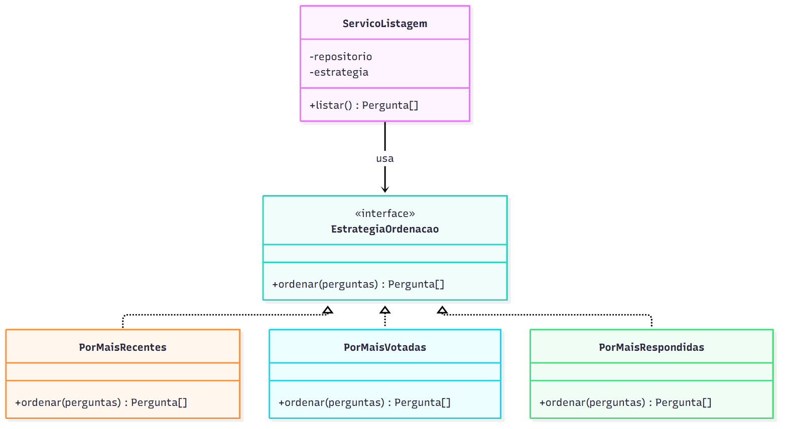
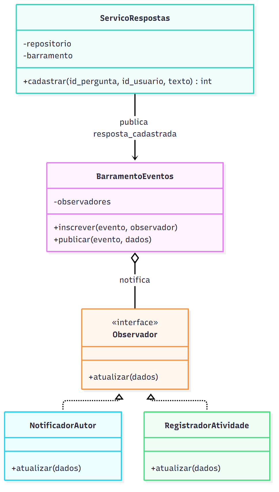
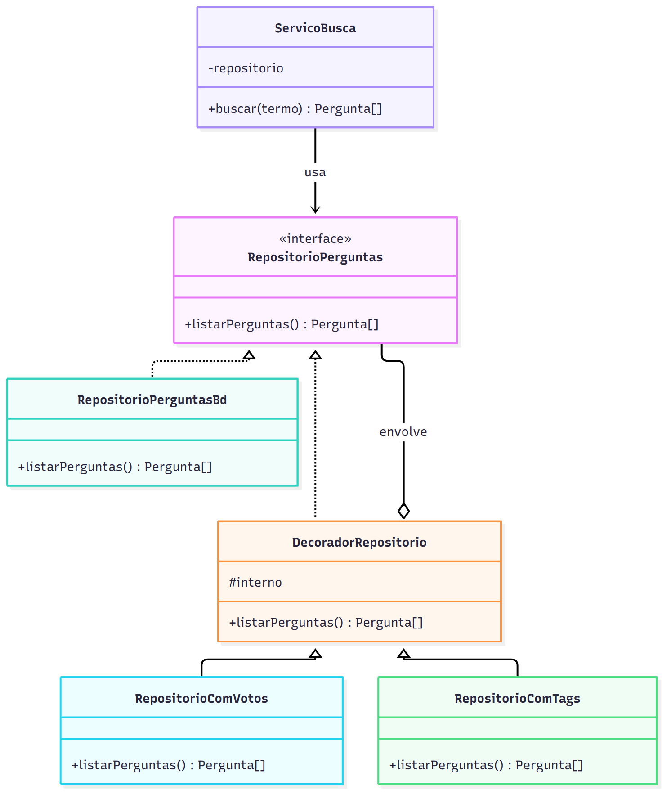

# Proposta de aplicação de Padrões de Projeto

Escolhi três padrões e proponho como aplicá-los às funcionalidades pedidas pelo cliente. Os diagramas de classes estão em [diagramas/](diagramas/), cada um com imagem `.png` e fonte Mermaid `.mmd`.

| # | Padrão | Categoria | Funcionalidade | Problema que resolve |
|---|---|---|---|---|
| 1 | Strategy | Comportamental | Votação e listagem de perguntas | Ordenar a lista de perguntas de várias formas sem `if` crescente |
| 2 | Observer | Comportamental | Notificação de novas respostas | Reagir ao cadastro de uma resposta sem acoplar o cadastro às consequências |
| 3 | Decorator | Estrutural | Votação, tags e perfil | Acrescentar dados às perguntas sem modificar o código existente |

---

## 1. Strategy: ordenação da lista de perguntas

### a) Justificativa e contexto

**Funcionalidade:** com a votação (história 2), a lista de perguntas deixa de ter uma única ordem natural. O usuário vai querer ver as mais votadas, as mais recentes ou as mais respondidas.

**Problema:** sem um padrão, a função de listagem receberia um parâmetro `ordem` e cresceria com um `if/else` ou `switch` para cada critério. Cada critério novo obrigaria a alterar a função (violação do OCP, como discutido em `ANALISE_SOLID.md`, item 2.2).

**Por que Strategy:** o padrão encapsula uma família de algoritmos intercambiáveis atrás de uma mesma interface. Aqui, cada critério de ordenação é um algoritmo. O sistema já usa esse padrão na busca (`busca/estrategias.js`), então a proposta segue uma estrutura já validada no projeto.

### b) Proposta de solução



Fonte: [padrao_strategy.mmd](diagramas/padrao_strategy.mmd)

**Classes e módulos:**
- `EstrategiaOrdenacao`: interface com o método `ordenar(perguntas)`.
- `PorMaisRecentes`, `PorMaisVotadas`, `PorMaisRespondidas`: estratégias concretas. Como a tabela `perguntas` não tem coluna de data, `PorMaisRecentes` usaria o `id_pergunta` em ordem decrescente (o identificador é autoincremental).
- `ServicoListagem`: recebe o repositório e a estratégia pelo construtor e devolve a lista ordenada.
- O controlador lê o parâmetro `?ordem=` da requisição e escolhe a estratégia num mapa (como `busca/index.js` já faz com o parâmetro `modo`).

**Interação:** a rota `GET /perguntas?ordem=votadas` obtém a estratégia `PorMaisVotadas`, cria o `ServicoListagem` com ela e chama `listar()`. O serviço busca as perguntas no repositório e delega a ordem à estratégia.

### c) Exemplo de código

```js
class EstrategiaOrdenacao {
  ordenar(perguntas) { throw new Error('não implementado'); }
}

class PorMaisVotadas extends EstrategiaOrdenacao {
  ordenar(perguntas) {
    return [...perguntas].sort((a, b) => b.saldo_votos - a.saldo_votos);
  }
}

class PorMaisRespondidas extends EstrategiaOrdenacao {
  ordenar(perguntas) {
    return [...perguntas].sort((a, b) => b.num_respostas - a.num_respostas);
  }
}

class ServicoListagem {
  constructor(repositorio, estrategia) {
    this.repositorio = repositorio;
    this.estrategia = estrategia;
  }
  listar() {
    return this.estrategia.ordenar(this.repositorio.listarPerguntas());
  }
}

// no controlador
const estrategias = { votadas: new PorMaisVotadas(), respondidas: new PorMaisRespondidas() };
const servico = new ServicoListagem(repositorio, estrategias[req.query.ordem] || estrategias.votadas);
res.json(servico.listar());
```

Para incluir "mais antigas primeiro" basta criar uma nova classe e registrá-la no mapa. `ServicoListagem` não muda.

---

## 2. Observer: notificação de novas respostas

### a) Justificativa e contexto

**Funcionalidade:** notificação de novas respostas (funcionalidade 5): quando alguém responde a uma pergunta, o autor deve ser notificado.

**Problema:** a solução mais simples seria chamar a notificação dentro da função `cadastrar_resposta`. Só que cadastrar a resposta e notificar são responsabilidades distintas. Além disso, é provável que surjam outras reações ao mesmo fato (registrar a atividade no histórico do perfil, enviar e-mail no futuro). Cada reação nova obrigaria a alterar `cadastrar_resposta`, que passaria a conhecer todas elas.

**Por que Observer:** o padrão permite que um objeto (o sujeito) publique um evento e vários interessados (os observadores) reajam a ele, sem que o sujeito os conheça. O cadastro da resposta apenas anuncia "uma resposta foi cadastrada".

### b) Proposta de solução



Fonte: [padrao_observer.mmd](diagramas/padrao_observer.mmd)

**Classes e módulos:**
- `BarramentoEventos`: o sujeito. Guarda a lista de observadores por tipo de evento e oferece `inscrever` e `publicar`. Em Node.js pode ser implementado com a classe `EventEmitter` da biblioteca padrão, sem dependências novas.
- `ServicoRespostas`: cadastra a resposta e publica o evento `resposta_cadastrada`.
- `Observador`: contrato com o método `atualizar(dados)`.
- `NotificadorAutor`: cria uma `Notificacao` para o autor da pergunta.
- `RegistradorAtividade`: acrescenta a resposta ao histórico do perfil do usuário (funcionalidade 4).

**Interação:** na inicialização do servidor, os observadores se inscrevem no barramento. Quando `ServicoRespostas.cadastrar` grava a resposta, publica o evento com os dados; o barramento chama `atualizar` de cada observador inscrito.

### c) Exemplo de código

```js
class BarramentoEventos {
  constructor() { this.observadores = {}; }

  inscrever(evento, observador) {
    (this.observadores[evento] ||= []).push(observador);
  }

  publicar(evento, dados) {
    (this.observadores[evento] || []).forEach(o => o.atualizar(dados));
  }
}

class ServicoRespostas {
  constructor(repositorio, barramento) {
    this.repositorio = repositorio;
    this.barramento = barramento;
  }

  cadastrar(id_pergunta, id_usuario, texto) {
    const id_resposta = this.repositorio.inserir(id_pergunta, id_usuario, texto);
    this.barramento.publicar('resposta_cadastrada', { id_resposta, id_pergunta, id_usuario });
    return id_resposta;
  }
}

class NotificadorAutor {
  constructor(repositorioNotificacoes, repositorioPerguntas) { /* ... */ }
  atualizar({ id_resposta, id_pergunta }) {
    const pergunta = this.repositorioPerguntas.buscarPorId(id_pergunta);
    this.repositorioNotificacoes.inserir(pergunta.id_usuario, id_resposta);
  }
}

// composição, no server.js
barramento.inscrever('resposta_cadastrada', new NotificadorAutor(repoNotificacoes, repoPerguntas));
barramento.inscrever('resposta_cadastrada', new RegistradorAtividade(repoAtividades));
```

**Cuidado de projeto:** os observadores rodam no mesmo processo e de forma síncrona. Se um deles falhar, o cadastro da resposta não pode ser desfeito por isso. Por isso `publicar` deve capturar e registrar as exceções dos observadores. Para o porte do sistema isso basta; um sistema maior usaria uma fila de mensagens.

---

## 3. Decorator: acrescentar dados às perguntas sem alterar o código existente

### a) Justificativa e contexto

**Funcionalidades:** votação (saldo de votos), tags (lista de tags) e perfil (nome do autor). Todas precisam de dados extras em cada pergunta listada.

**Problema:** em `modelo.js`, a função `listar_perguntas` embute o cálculo de `num_respostas`. Para cada nova informação, ela teria de ser editada (e o teste `listar_perguntas.test.js` junto), o que viola o OCP e faz a função crescer sem parar (`ANALISE_SOLID.md`, item 2.2).

**Por que Decorator:** o padrão envolve um objeto em outros que têm a mesma interface, cada um acrescentando um comportamento. Aqui, cada decorador enriquece o resultado de `listarPerguntas()` com um dado, e podem ser combinados na ordem e na quantidade necessárias. É uma extensão por composição, sem alterar as classes existentes.

### b) Proposta de solução



Fonte: [padrao_decorator.mmd](diagramas/padrao_decorator.mmd)

**Classes e módulos:**
- `RepositorioPerguntas`: interface com `listarPerguntas()`. A implementação `RepositorioPerguntasBd` já existe em `busca/repositorio_perguntas.js`.
- `DecoradorRepositorio`: classe base dos decoradores; guarda o repositório envolvido (`interno`) e, por padrão, apenas repassa a chamada.
- `RepositorioComVotos`: acrescenta `saldo_votos` a cada pergunta, com uma consulta agrupada sobre a tabela de votos.
- `RepositorioComTags`: acrescenta `tags` a cada pergunta.
- `ServicoBusca` e `ServicoListagem` continuam dependendo apenas da interface, então não sabem quantos decoradores existem.

**Interação:** o `ServicoBusca` chama `listarPerguntas()` no decorador mais externo; cada decorador chama o seguinte, recebe a lista e acrescenta seu dado, até chegar ao repositório do banco.

### c) Exemplo de código

```js
class DecoradorRepositorio {
  constructor(interno) { this.interno = interno; }
  listarPerguntas() { return this.interno.listarPerguntas(); }
}

class RepositorioComVotos extends DecoradorRepositorio {
  constructor(interno, bd) { super(interno); this.bd = bd; }

  listarPerguntas() {
    const perguntas = super.listarPerguntas();
    const saldos = this.bd.queryAll(
      'select id_pergunta, sum(valor) as saldo from votos group by id_pergunta', []);
    const porId = new Map(saldos.map(s => [s.id_pergunta, s.saldo]));
    return perguntas.map(p => ({ ...p, saldo_votos: porId.get(p.id_pergunta) || 0 }));
  }
}

class RepositorioComTags extends DecoradorRepositorio { /* análogo, acrescenta p.tags */ }

// composição: cada extensão é uma linha, e nada existente foi editado
const repositorio = new RepositorioComTags(
  new RepositorioComVotos(new RepositorioPerguntasBd(bd), bd), bd);
const busca = new ServicoBusca(repositorio, new BuscaPorTrecho());
```

Com esta estrutura, a busca passa a encontrar perguntas já com o saldo de votos e as tags, sem que `ServicoBusca` seja alterado.

---

## Como os três padrões se combinam

Os padrões se complementam: o **Decorator** monta os dados de cada pergunta (saldo de votos, tags), o **Strategy** define como filtrar (busca) e ordenar (por votos, respondidas) essa lista, e o **Observer** cuida das reações a eventos (notificação quando chega uma resposta). Cada um resolve um problema diferente, e nenhum exige modificar os outros.
