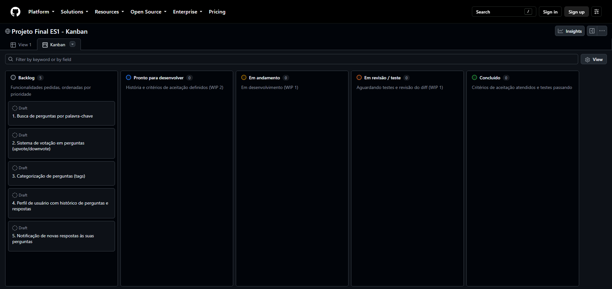

# Processo de Desenvolvimento: Kanban

Para gerenciar o desenvolvimento das cinco funcionalidades solicitadas pelo cliente, escolhi um quadro estilo **Kanban** no GitHub Projects.

**Quadro no GitHub Projects:** https://github.com/users/tteudev/projects/2 (visão "Kanban", em formato de quadro). A configuração está descrita na seção 4.

## 1. O que é o Kanban

Kanban é um método ágil de gestão de fluxo de trabalho. Suas características principais são:

- **Quadro visual:** todo o trabalho fica em cartões distribuídos em colunas que representam as etapas do processo (por exemplo, "A fazer", "Em andamento", "Concluído"). Basta olhar para o quadro para saber o estado do projeto.
- **Fluxo contínuo:** os itens são puxados para a próxima etapa quando há capacidade, e não em blocos com data de início e fim. Não existem sprints com escopo fechado.
- **Limite de trabalho em andamento (WIP):** cada coluna de trabalho ativo tem um número máximo de cartões. Isso evita começar muitas coisas ao mesmo tempo e força a terminar o que já foi iniciado.
- **Sistema puxado:** ao ter capacidade, o desenvolvedor puxa o próximo cartão mais prioritário do topo do *backlog*.
- **Melhoria contínua e métricas:** o processo é observado e ajustado com base em medidas como o tempo de ciclo (do início ao fim de um cartão) e a vazão (cartões concluídos por período).
- **Priorização explícita:** a ordem dos cartões no backlog reflete a prioridade, e ela pode mudar a qualquer momento.

## 2. Comparação com o Scrum

| Aspecto | Scrum | Kanban |
|---|---|---|
| Cadência | Sprints de tamanho fixo (1 a 4 semanas) | Fluxo contínuo |
| Papéis | Product Owner, Scrum Master, time | Nenhum papel obrigatório |
| Escopo | Fechado durante o sprint | Pode mudar a qualquer momento |
| Controle | Velocidade e *burndown* por sprint | Limite de WIP, tempo de ciclo, vazão |
| Cerimônias | Planning, Daily, Review, Retrospective | Nenhuma obrigatória |

## 3. Por que o Kanban é adequado a este projeto

1. **Trabalho individual.** O Scrum foi desenhado para times e depende de papéis (Product Owner, Scrum Master) e de cerimônias que não fazem sentido com uma pessoa só. O Kanban não exige nada disso e ainda oferece visibilidade e disciplina.
2. **Funcionalidades independentes.** As cinco funcionalidades (votação, busca, tags, perfil e notificações) podem ser desenvolvidas e entregues cada uma por si. Isso combina com um fluxo em que cada cartão passa pelas colunas de forma independente, sem precisar caber em um sprint.
3. **Tamanhos e prioridades que podem mudar.** Como o cliente pode mudar de ideia, e como algumas funcionalidades dependem de outras (o perfil de usuário e as notificações pedem a noção de usuário, que o sistema não tem), a possibilidade de reordenar o backlog a qualquer momento é uma vantagem.
4. **Limite de WIP como controle pessoal.** Trabalhando sozinho, o risco é abrir várias frentes ao mesmo tempo. Um limite de 1 cartão em "Em andamento" me força a terminar uma funcionalidade antes de começar a próxima.
5. **Baixo custo de processo.** O GitHub Projects já oferece o quadro Kanban, integrado aos repositórios, sem custo de configuração de reuniões.

O ponto fraco do Kanban para este caso é não ter prazos internos naturais como os de um sprint. Para compensar, usei o prazo de entrega do trabalho como referência e priorizei os cartões em função dele.

## 4. Configuração do quadro

O quadro foi criado no GitHub Projects, vinculado ao repositório e com visibilidade pública. Os cinco cartões iniciais estão em "Backlog", na ordem de prioridade da tabela abaixo.

### Colunas

| Coluna | Significado | Limite de WIP |
|---|---|---|
| **Backlog** | Funcionalidades pedidas, ordenadas por prioridade (topo = mais prioritária) | Sem limite |
| **Pronto para desenvolver** | Cartão com história e critérios de aceitação definidos | 2 |
| **Em andamento** | Em desenvolvimento | 1 |
| **Em revisão / teste** | Código escrito, aguardando testes e revisão do próprio diff | 1 |
| **Concluído** | Critérios de aceitação atendidos e testes passando | Sem limite |

### Cartões iniciais e prioridade

| # | Funcionalidade | Justificativa da prioridade |
|---|---|---|
| 1 | Busca de perguntas por palavra-chave | Maior valor imediato ao usuário, pois com o crescimento do fórum encontrar perguntas é essencial; tem escopo pequeno e não depende de outras funcionalidades |
| 2 | Sistema de votação em perguntas | Destaca as perguntas úteis; depende de identificar o usuário (na versão inicial, o usuário fixo do sistema) |
| 3 | Categorização de perguntas (tags) | Melhora a organização e complementa a busca; exige alteração de esquema (relação N:N) |
| 4 | Perfil de usuário com histórico | Depende de criar o conceito de usuário no sistema, hoje inexistente, então tem custo e risco maiores |
| 5 | Notificação de novas respostas | Depende do perfil de usuário (para saber quem notificar) e de um mecanismo de entrega, sendo a mais custosa |

A ordem segue dois critérios: **valor para o usuário** (decrescente) e **dependências** (o que é pré-requisito de outra funcionalidade vem antes). Essa priorização é o critério que aplico também em `HISTORIAS.md`.

### Regras do quadro

1. Só se puxa um cartão para "Em andamento" quando não há nenhum outro lá (limite 1).
2. Um cartão só vai para "Concluído" quando seus critérios de aceitação são atendidos e os testes passam.
3. Cada cartão gera commits com mensagens descritivas que referenciam o assunto do cartão.
4. Ao final de cada funcionalidade, reviso o tempo que ela levou para ajustar as estimativas das próximas (tempo de ciclo).
