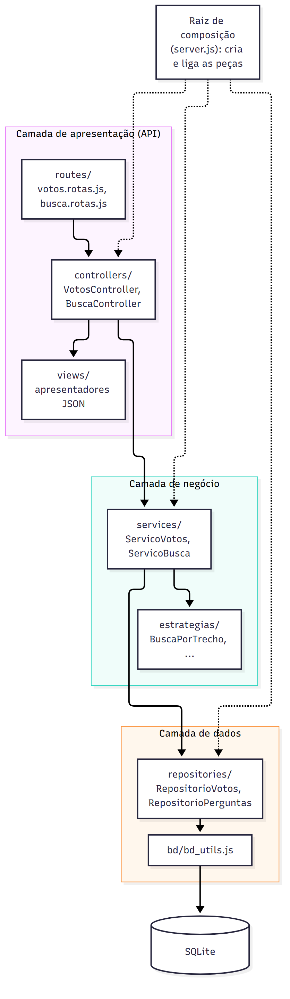
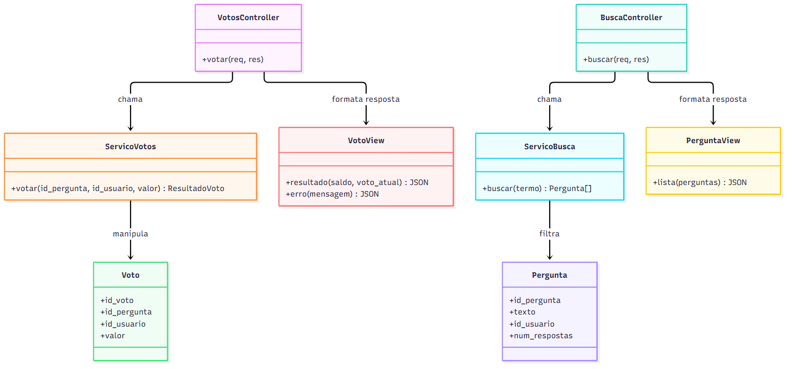

# Proposta de Organização Arquitetural

Esta proposta reorganiza o backend do ESM Forum para acomodar as funcionalidades pedidas (busca, votação, tags, perfil e notificações), corrigindo as limitações apontadas em `ARQUITETURA.md`: negócio e dados misturados em `modelo.js`, controlador em um arquivo só e dependências concretas criadas dentro dos módulos. A proposta é evolutiva: a busca já foi implementada seguindo essa organização (`busca/`), e o restante do sistema pode migrar aos poucos.

## 1. Separação em camadas

### Estrutura de pastas proposta

```
esmforum/
  server.js                 raiz de composição: cria as peças e liga tudo
  routes/                   camada de apresentação: mapeia URL para controlador
    perguntas.rotas.js
    votos.rotas.js
    busca.rotas.js
  controllers/              camada de apresentação: traduz HTTP para chamadas de serviço
    PerguntasController.js
    VotosController.js
    BuscaController.js
  views/                    camada de apresentação: formata as respostas JSON
    PerguntaView.js
    VotoView.js
  services/                 camada de negócio: regras da aplicação
    ServicoPerguntas.js
    ServicoVotos.js
    ServicoBusca.js
  estrategias/              regras intercambiáveis (busca, ordenação)
  repositories/             camada de dados: SQL
    RepositorioPerguntas.js
    RepositorioVotos.js
  bd/                       conexão e esquema do SQLite
```



Fonte: [arquitetura_camadas.mmd](diagramas/arquitetura_camadas.mmd)

### Camada de apresentação (API)

**Responsabilidades:**
- Receber a requisição HTTP e validar o formato (por exemplo, que `valor` do voto é um número).
- Chamar o serviço adequado.
- Traduzir o resultado ou o erro para o código HTTP correto (200, 400, 404, 500) e para JSON.
- Não conter regra de negócio nem SQL.

**Módulos:** `routes/*.rotas.js` (usam o `Router` do Express, um arquivo por funcionalidade), `controllers/*Controller.js` e `views/*View.js`.

### Camada de negócio

**Responsabilidades:**
- Implementar as regras da aplicação: "um usuário só tem um voto por pergunta", "voto repetido retira o voto", "pergunta sem tag recebe a tag padrão", "termo de busca vazio devolve tudo".
- Coordenar os repositórios. Não conhecer HTTP nem SQL.
- Lançar erros de domínio (por exemplo, `PerguntaNaoEncontrada`), que a camada de apresentação converte em 404.

**Módulos:** `ServicoPerguntas`, `ServicoVotos`, `ServicoBusca` (já existe em `busca/servico_busca.js`) e as estratégias em `estrategias/`.

### Camada de dados

**Responsabilidades:**
- Executar as consultas e comandos SQL e devolver objetos simples.
- Ser o único lugar que conhece o esquema do banco.
- Expor operações com nomes do domínio (`buscarVoto`, `inserirVoto`, `somarVotos`), e não SQL genérico.

**Módulos:** `RepositorioPerguntas` (já existe em `busca/repositorio_perguntas.js`), `RepositorioVotos` e o `bd/bd_utils.js` existente, que continua como fachada da biblioteca do SQLite.

### Como as camadas se comunicam

A regra é: **cada camada depende somente da camada imediatamente abaixo, e sempre por meio de uma interface, nunca por meio de uma implementação concreta**.

- O controlador chama métodos do serviço; o serviço chama métodos do repositório. Nunca o contrário, e o controlador não fala com o repositório.
- As dependências são passadas pelo construtor (injeção de dependência). Quem cria e liga tudo é o `server.js`, a raiz de composição:

```js
// server.js
const bd = require('./bd/bd_utils.js');

const repositorioVotos = new RepositorioVotos(bd);
const repositorioPerguntas = new RepositorioPerguntas(bd);

const servicoVotos = new ServicoVotos(repositorioVotos, repositorioPerguntas);
const votosController = new VotosController(servicoVotos);

app.use('/perguntas', votosRotas(votosController));
```

**Ganhos:** cada camada pode ser testada isoladamente com dobras de teste (o serviço com repositórios falsos; o controlador com um serviço falso); trocar o SQLite por outro banco só afeta os repositórios; e adicionar uma funcionalidade significa adicionar arquivos, e não editar os existentes.

## 2. Aplicação do padrão MVC

Proponho MVC para duas funcionalidades: **votação** e **busca**. No backend que é uma API JSON, a **Visão** não é HTML e sim a formatação da resposta JSON.



Fonte: [arquitetura_mvc.mmd](diagramas/arquitetura_mvc.mmd)

### Papéis

| Papel | Votação | Busca |
|---|---|---|
| **Model** | `Voto` (dados: `id_pergunta`, `id_usuario`, `valor`) e `ServicoVotos`, com as regras: valor +1 ou -1, um voto por usuário, troca e retirada | `Pergunta` (`id_pergunta`, `texto`, `id_usuario`, `num_respostas`) e `ServicoBusca` com a estratégia de correspondência |
| **View** | `VotoView`: formata `{ saldo, voto_atual }` ou `{ erro }` | `PerguntaView`: formata a lista de perguntas encontradas |
| **Controller** | `VotosController.votar`: lê o `id_pergunta` da URL e `id_usuario` e `valor` do corpo, chama `ServicoVotos.votar` e escolhe o código HTTP | `BuscaController.buscar`: lê `q` e `modo` da query string, chama `ServicoBusca.buscar` |

### Operações do Model (votação)

- `votar(id_pergunta, id_usuario, valor)`: valida o valor; verifica se a pergunta existe; aplica a regra de inserir, trocar ou retirar o voto; devolve o novo saldo e o voto atual do usuário.

### Como cada componente funciona (votação)

```js
// Controller: só traduz HTTP
class VotosController {
  constructor(servicoVotos) { this.servicoVotos = servicoVotos; }

  votar(req, res) {
    try {
      const { id_usuario, valor } = req.body;
      const resultado = this.servicoVotos.votar(Number(req.params.id_pergunta), id_usuario, valor);
      res.status(200).json(VotoView.resultado(resultado));
    } catch (erro) {
      const status = erro.name === 'PerguntaNaoEncontrada' ? 404
                   : erro.name === 'VotoInvalido' ? 400 : 500;
      res.status(status).json(VotoView.erro(erro.message));
    }
  }
}

// Model (serviço): regras de negócio, sem HTTP e sem SQL
class ServicoVotos {
  constructor(repositorioVotos, repositorioPerguntas) { /* ... */ }

  votar(id_pergunta, id_usuario, valor) {
    if (valor !== 1 && valor !== -1) throw new VotoInvalido('Voto inválido');
    if (!this.repositorioPerguntas.existe(id_pergunta)) throw new PerguntaNaoEncontrada('Pergunta não encontrada');

    const anterior = this.repositorioVotos.buscar(id_pergunta, id_usuario);
    if (!anterior)                     this.repositorioVotos.inserir(id_pergunta, id_usuario, valor);
    else if (anterior.valor !== valor) this.repositorioVotos.atualizar(anterior.id_voto, valor);
    else                               this.repositorioVotos.remover(anterior.id_voto);

    return {
      saldo: this.repositorioVotos.somar(id_pergunta),
      voto_atual: this.repositorioVotos.buscar(id_pergunta, id_usuario)?.valor ?? 0,
    };
  }
}

// View: formato do JSON, num só lugar
class VotoView {
  static resultado({ saldo, voto_atual }) { return { saldo, voto_atual }; }
  static erro(mensagem) { return { erro: mensagem }; }
}
```

Na busca, o `BuscaController` faz o mesmo: lê `q` e `modo`, chama `ServicoBusca` e devolve `PerguntaView.lista(perguntas)`. O `ServicoBusca` e o `RepositorioPerguntas` já existem em `busca/`.

### Exemplo de fluxo completo: votar (requisição até resposta)

1. **Requisição:** o usuário clica em upvote; o React envia

   ```
   POST /perguntas/6/votos
   Content-Type: application/json

   { "id_usuario": 1, "valor": 1 }
   ```

2. `routes/votos.rotas.js` casa a URL e chama `votosController.votar`.
3. O **Controller** extrai `id_pergunta = 6`, `id_usuario = 1` e `valor = 1` e chama `servicoVotos.votar(6, 1, 1)`.
4. O **Model** (`ServicoVotos`) valida o valor, pergunta ao `RepositorioPerguntas` se a pergunta 6 existe, busca no `RepositorioVotos` o voto anterior, e grava o novo voto (`INSERT`). Depois soma os votos da pergunta (`SELECT sum(valor)`).
5. O `RepositorioVotos` executa os SQL por meio do `bd_utils.js` no SQLite.
6. O Model devolve `{ saldo: 4, voto_atual: 1 }` ao Controller.
7. O Controller entrega o resultado à **View**, que monta o JSON, e responde:

   ```
   200 OK
   { "saldo": 4, "voto_atual": 1 }
   ```

8. O React atualiza o saldo e destaca o botão de upvote.

Se a pergunta 6 não existisse, no passo 4 o serviço lançaria `PerguntaNaoEncontrada`, o Controller responderia `404` com `{ "erro": "Pergunta não encontrada" }` e nada seria gravado.

### Exemplo de fluxo completo: busca

`GET /perguntas/busca?q=array` chega ao `BuscaController`, que chama `ServicoBusca.buscar('array')`. O serviço pede as perguntas ao repositório, filtra com a estratégia `BuscaPorTrecho` e devolve a lista. A `PerguntaView` formata e a API responde `200` com `[{ "id_pergunta": 1, "texto": "...", "id_usuario": 1, "num_respostas": 2 }]`.

## 3. Pontos de atenção para a evolução

- **Migração gradual.** O `modelo.js` e as rotas atuais podem continuar em funcionamento enquanto as funcionalidades novas seguem a nova estrutura. As perguntas e respostas antigas migrariam para `ServicoPerguntas` e `RepositorioPerguntas` quando fosse conveniente.
- **Identificação do usuário.** A votação e o perfil exigem saber quem age. Na proposta o `id_usuario` vem no corpo da requisição, o que é aceitável só em um sistema didático. Em um sistema real, viria de um *middleware* de autenticação (sessão ou token), e o controlador leria `req.usuario.id`.
- **Notificações.** Como a API só responde a requisições, a primeira versão usaria *polling*: o frontend consulta `GET /notificacoes` periodicamente. A geração das notificações seguiria o padrão Observer proposto em `PADROES_PROPOSTOS.md`.
- **Frontend.** A URL da API deve sair dos componentes e ir para uma configuração única (por exemplo, `REACT_APP_API_URL`), e as chamadas `fetch` devem ficar em um módulo de acesso à API, para a camada de apresentação do frontend também ficar separada.
